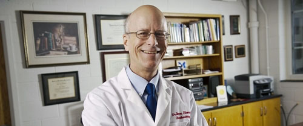

```{r setup, include=FALSE}
knitr::opts_chunk$set(echo = TRUE,fig.align = "center")
```

# Pain Mechanisms Lab


---    



### Welcome from Dr. James Eisenach 
Pain Research began with a collaboration between myself and Tony Yaksh nearly 25 years ago and has now grown to a vibrant group of investigators, post-doctoral fellows, students, and technicians.  Throughout that time the core values of the laboratory have remained the same – to be a place of education and excited learning as we explore the translational science of pain and its treatment. We learn together through regular meetings, both formal and informal.  My role as director of the laboratory is to foster these interactions, understand the career goals of all individuals in the laboratory, and assure that the experience of everyone here meets those goals.      

This is a friendly place doing great science. We have brought 5 new non-opioid analgesic therapies from discovery to human clinical trials, including one which is FDA approved and the most commonly used non-narcotic spinal drug in the treatment of neuropathic pain.  At nearly every meeting we discuss clinical needs and potential clinical application of our work, and most fellows interact with clinician investigators to test some aspects in humans of the work they perform in the lab.  

### GC Modelr
GC Modelr is developed and maintained by Dr. Hao Deng and Dr. Timothy Houle at Anesthesia Biostatistics Consulting (ABC) of Massachusetts General Hospital. This automatic statistical research tool is aimed to facilitate researchers in conducting reproducible research modeling process with an easy-to-use user interface.
